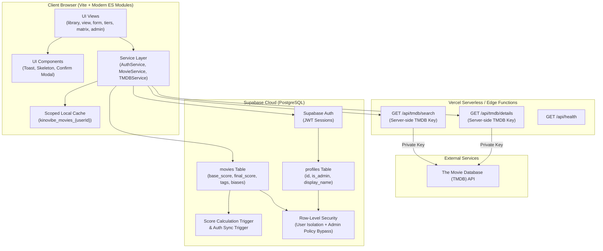

# 🎬 KinoVibe (v0.3)

> **Personal & Community Cinematic Movie Review, Tier Ranking & Profile Platform**  
> Rate films across 4 core criteria, apply personal biases, link live metadata via secure TMDB proxy, build your cinephile profile with social integrations (Letterboxd, X, Instagram, YouTube), and sync your collection reliably to Supabase Cloud with PostgreSQL triggers, RLS security, and admin moderation.

---

## 🌟 Overview

**KinoVibe** is a cinematic movie review web application designed for cinephiles who value nuanced critique over flat star ratings. Rate movies on **Story**, **Visuals**, **Action**, and **Fun**, adjust for personal quirks with a flexible **Bias System**, plot movies on a 2D **Quality vs. Entertainment Matrix**, and watch your library automatically organize into an **S-to-F Tier List**.

---

## 🏗️ System Architecture (v0.2)



---

## ✨ Features in v0.2

### 1. 🛡️ API Key Security & Serverless Proxy
- **Zero Exposed Keys**: Client code no longer holds `TMDB_API_KEY`.
- All autocomplete search requests route through `/api/tmdb/search` and details through `/api/tmdb/details`.
- In production, serverless endpoints run on Vercel Node.js runtime with edge caching (`s-maxage=3600`).
- In local development, the Vite dev server transparently proxies `/api/tmdb` requests using `.env`.

### 2. 🔒 Supabase Security & RLS Policy Hardening
- **PostgreSQL CHECK Constraints**: Enforces `0 <= score <= 10`, non-empty title, and valid release years at the database level.
- **Ownership Verification**: `UPDATE` policies enforce `WITH CHECK` to prevent users from altering record ownership.
- **Admin Access Bypass**: Secure `SECURITY DEFINER` function `is_admin()` allows platform moderators to manage content without recursive policy errors.
- **User-Isolated Storage**: Local caching is strictly partitioned per user (`kinovibe_movies_${userId}`) and purged upon sign-out.

### 3. 🗄️ Cleaned Data Model & Automated Server Scores
- **Computed Server Scores**: Dedicated `base_score numeric(3,1)` and `final_score numeric(3,1)` columns.
- **PostgreSQL Trigger**: `trg_calculate_movie_scores` automatically computes, clamps (0.0–10.0), and indexes scores on every `INSERT` or `UPDATE`.
- **First-Class Tags**: Native `tags text[]` with PostgreSQL GIN indexing for fast filtering.
- **`profiles` Table**: Automatically synced with `auth.users` via database triggers, storing display names, avatars, and admin privileges.
- **Public & Community Reviews**: Optional `is_public` boolean allows public reviews and shareable links.

### 4. 💫 Error Handling & Modern UI Feedback
- **Non-blocking Toast Notifications**: Replaces disruptive native browser `alert()` popups.
- **Animated Skeleton Placeholders**: Shimmer skeleton cards displayed during loading states.
- **Offline / Local Cache Resilience**: Graceful degradation when network or Supabase Cloud is unreachable.

### 5. 🛡️ Admin & Moderation Portal (`admin.html`)
- Dedicated administrative interface restricted to users with `is_admin = true`.
- Real-time platform metrics: Total registered users, total reviews, public/private ratio, platform average score, and tier breakdown.
- User directory and content moderation table with one-click review visibility toggling and administrative deletion.

### 6. ⚡ Modern Vite Tooling & API Abstraction
- Modular code architecture separated into `src/services`, `src/utils`, and `src/pages`.
- Vite dev server with instant HMR and multi-page entry points.

---

## 🚀 Getting Started (What To Do Next)

Follow these steps to set up and run KinoVibe v0.2:

### Step 1: Run Supabase SQL Migration
1. Open your project on the [Supabase Dashboard](https://supabase.com/dashboard).
2. Navigate to the **SQL Editor** tab.
3. Open the migration file: [`supabase/migrations/001_v02_schema_and_rls.sql`](file:///d:/Wengdev/KinoVibe/supabase/migrations/001_v02_schema_and_rls.sql).
4. Paste the entire SQL script into the Supabase SQL Editor and click **Run**.
   - This creates the `profiles` table, adds score columns and triggers, sets up CHECK constraints, and applies hardened RLS policies.

### Step 2: TMDB API Key Rotation & Environment Variables
1. Because the v0.1 TMDB key was previously committed to git history, generate a fresh API key at [themoviedb.org/settings/api](https://www.themoviedb.org/settings/api).
2. Copy `.env.example` to `.env`:
   ```bash
   cp .env.example .env
   ```
3. Update `.env` with your credentials:
   ```env
   VITE_SUPABASE_URL=https://your-project.supabase.co
   VITE_SUPABASE_ANON_KEY=your_supabase_anon_public_key
   TMDB_API_KEY=your_fresh_tmdb_api_key
   ```

### Step 3: Install Dependencies & Run Locally
```bash
# Install Vite & Supabase JS
npm install

# Start Vite local development server
npm run dev
```
Open `http://localhost:5173` in your browser.

### Step 4: Promote Your First Admin User (Optional)
To access the platform administration portal (`admin.html`):
1. Sign up for an account via `login.html`.
2. Go to your **Supabase Dashboard → SQL Editor** and run:
   ```sql
   UPDATE public.profiles
   SET is_admin = true
   WHERE email = 'your-email@example.com';
   ```
3. Refresh KinoVibe; an **🛡️ Admin** link will appear in your navigation bar!

---

## 🌐 Deploying to Vercel

1. Commit and push your code to your GitHub repository:
   ```bash
   git add .
   git commit -m "KinoVibe v0.2 Release"
   git push origin main
   ```
2. In your [Vercel Dashboard](https://vercel.com/):
   - Go to your Project **Settings → Environment Variables**.
   - Add the following environment variables:
     - `TMDB_API_KEY`: *(Your private TMDB API key — used by `/api/tmdb/*` serverless functions)*
     - `VITE_SUPABASE_URL`: *(Your Supabase project URL)*
     - `VITE_SUPABASE_ANON_KEY`: *(Your Supabase anon key)*
3. Trigger a deployment. Vercel will automatically build the static frontend with Vite and deploy the serverless functions in `/api/`.

---

## 📁 Clean Codebase Organization

```
KinoVibe/
├── index.html                  # Landing page
├── library.html                # User movie library
├── tiers.html                  # S-to-F auto tier list
├── matrix.html                 # 2D Quality vs. Entertainment matrix
├── view.html                   # Movie review detail view
├── add.html                    # Add review form
├── edit.html                   # Edit review form
├── login.html                  # Authentication portal
├── profile.html                # Cinephile profile & social links
├── admin.html                  # Moderation & analytics dashboard
│
├── public/                     # Static assets served by Vite
│   └── hero.jpeg               # Landing hero banner
│
├── src/
│   ├── config.js               # Application configuration
│   ├── app.js                  # Shared application bridge
│   ├── styles/
│   │   └── main.css            # Consolidated Tailwind & custom design system
│   ├── services/               # API & data repository services
│   │   ├── api.service.js
│   │   ├── auth.service.js
│   │   ├── profile.service.js  # Profile & socials data service
│   │   ├── movie.service.js
│   │   ├── tmdb.service.js
│   │   └── admin.service.js
│   ├── utils/                  # Core math & UI utilities
│   │   ├── scoring.js
│   │   ├── socials.js          # Social platforms config & normalizers
│   │   └── ui.js
│   └── pages/                  # Page-specific controllers
│       ├── landing.js
│       ├── library.js
│       ├── detail.js
│       ├── form.js
│       ├── tiers.js
│       ├── matrix.js
│       ├── login.js
│       ├── profile.js          # Profile view & edit controller
│       └── admin.js
│
├── api/                        # Vercel serverless functions
│   ├── health.js
│   └── tmdb/
│       ├── details.js
│       └── search.js
│
└── supabase/
    └── migrations/
        ├── 001_v02_schema_and_rls.sql
        └── 002_v03_profile_and_socials.sql
```

---

## 📋 Release Notes — v0.3 (Profile System with Socials)

- **Cinephile Profiles & Social Integrations**:
  - Dedicated profile portal (`profile.html`) with public sharing (`?u=@username` or `?id=uuid`) and owner edit mode.
  - First-class support for **Letterboxd**, plus X/Twitter, Instagram, YouTube, and personal website links.
  - Automatic URL normalization converts handles (`@username`) or full links into verified, styled external badges with brand icons.
  - Cinephile stats: Total films reviewed, overall average rating, S-tier masterpieces count, and top favorite genre.
  - Personalized taste highlights: All-time favorite movie badge, primary genre, and custom bio.
  - Customizable avatars: supports custom image links or one-click emoji presets (🍿, 🎬, 👑, 🎥, 🦇, 🛸, etc.) with real-time preview.
- **Cross-Platform Integration**:
  - Clickable avatar badge and "👤 Profile" link in desktop navbar and mobile bottom navigation across the entire app.
  - Reviewer attribution card on movie detail pages (`view.html`) linking directly to the reviewer's profile.
- **Database & Architecture**:
  - Added [`002_v03_profile_and_socials.sql`](file:///d:/Wengdev/KinoVibe/supabase/migrations/002_v03_profile_and_socials.sql) with columns for bio, socials, favorite film/genre, and username indexing.
  - Client services include graceful offline fallbacks and error handling.

---

## 📄 License
MIT © 2026 KinoVibe. Built for movie lovers.
